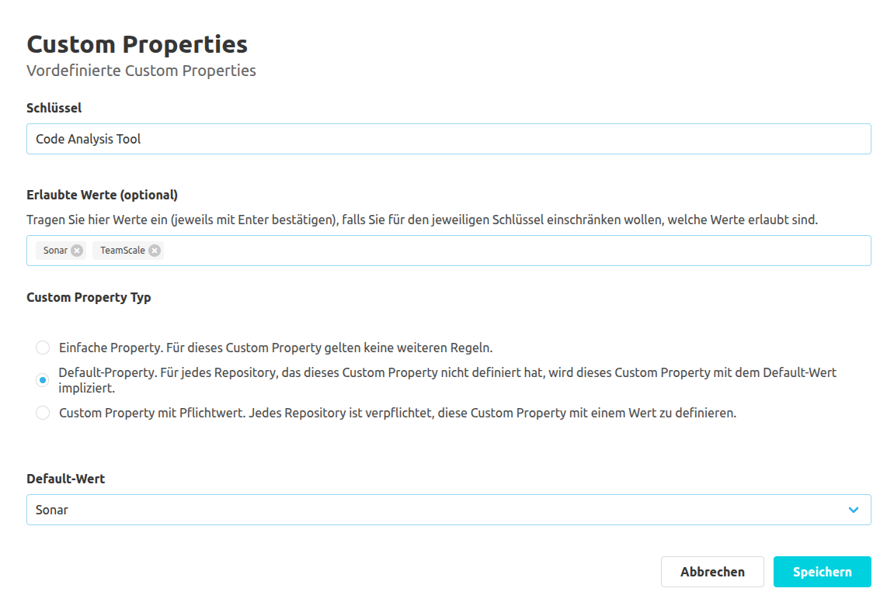
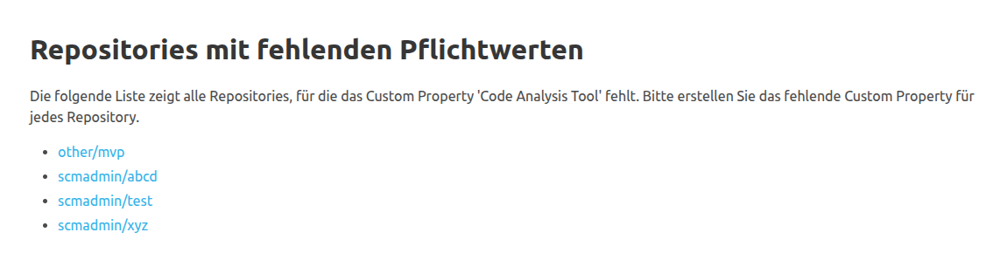

## Globale Konfiguration

### Allgemeine Einstellungen

Im Bereich "Allgemeine Einstellungen" unter "Administration" - "Einstellungen" - "Custom Properties"
kann das Plugin generell aktiviert bzw. deaktiviert werden.
Zudem ist es möglich, Konfigurationen auf Namespace-Ebene zu verhindern.
Dazu muss der Button zum Bearbeiten der jeweiligen Einstellung betätigt werden.
Dies navigiert den Benutzer zu einer Unterseite, auf der die Einstellung vorgenommen werden kann.

### Vordefinierte Schlüssel

#### Anlegen eines Schlüssels

Um den Benutzer beim Anlegen von Custom Properties zu unterstützen, können vordefinierte Schlüssel angelegt werden.
Um einen neuen Schlüssel anzulegen, muss der Button "Custom Property vordefinieren" betätigt werden.
Dadurch wird der Benutzer zu einer neuen Unterseite navigiert.
Hier kann der Benutzer in einem Text-Input einen neuen Schlüssel definieren.
Für vordefinierte Schlüssel gelten die gleichen Validierungsregeln, wie beim Anlegen einer Custom Property ([siehe Dokumentation zur Übersicht](../overview)).

Zusätzlich kann der Benutzer mit einem Chip-Input eine Liste von Werten definieren, welche
für Custom Properties mit dem jeweiligen Schlüssel verwendet werden dürfen.
Um einen Wert hinzuzufügen, muss dieser im Eingabefeld eingegeben und anschließend mit der Eingabetaste
bestätigt werden. Bestehende Werte können mit den kleinen "x"-Symbol neben dem Wert wieder aus der Liste entfernt werden.
Bereits für Repositories gesetzte Properties werden bei einer Änderung der Konfiguration nicht nachträglich validiert.

Des Weiteren kann der Benutzer mit einem Radio Input noch einen Typ für die Custom Property festlegen.
Dafür gibt es vier Optionen:
Eine einfache Property, eine Default-Property, eine Custom Property mit Pflichtwert und eine Custom Property mit Mehrfachauswahl.

Bei Custom Properties mit Pflichtwert wird festgelegt,
dass jedes Repository eine Custom Property mit dem jeweiligen Schlüssel und einem Wert definieren muss.

Bei Default-Properties wird ein Default-Wert implizit angenommen, falls für ein Repository die jeweilige Custom Property noch nicht definiert wurde.
Falls Default-Property als Typ festgelegt wurde, muss auch einen Default-Wert angeben werden.
Sollten die Werte für die Custom Property uneingeschränkt sein (wenn also keine erlaubten Werte gesetzt sind),
erfolgt die Eingabe des Default-Werts mithilfe eines Text-Inputs.
Sind erlaubte Werte vorgegeben, dann steht ein Dropdown mit allen erlaubten Werten und einer leeren Eingabe als Optionen zur Verfügung.

Bei Custom Properties mit Mehrfachauswahl ist es möglich, mehrere Werte für die jeweilige Custom Property zu setzen.
Für diesen Typ müssen jedoch erlaubte Werte definiert sein.

Bei einer einfachen Property gelten keine weiteren Regeln.

#### Übersicht über alle vordefinierten Schlüssel

Die vordefinierten Schlüssel können auch in der Schlüsselübersicht mithilfe der jeweiligen Aktions-Buttons bearbeitet und gelöscht werden.
In der Schlüsselübersicht wird ebenfalls angezeigt, ob für die jeweilige Custom Property eine Mehrfachauswahl, ein Default- oder Pflichtwert definiert wurde.
Falls die Custom Property einen Pflichtwert hat, dann wird mithilfe von Icons dargestellt, ob alle Repositories diesen Pflichtwert auch definiert haben.
Sollte mindestens ein Repository fehlen, wird ein Warn-Icon als Rückmeldung angezeigt.
Auf dieses Icon kann geklickt werden, um eine Übersicht über alle Repositories zu erhalten, für die der Pflichtwert noch definiert werden muss.

## Namespace-Konfiguration

Auf Namespace-Ebene können weitere Schlüssel definiert werden.
Diese werden entsprechend nur für Repositories des jeweiligen Namespaces vorgeschlagen.
Das Erstellen, Bearbeiten und Löschen der Schlüssel erfolgt dabei analog zu der globalen Konfiguration.
Zusätzlich werden global definierte Schlüssel ebenfalls in der Schlüsselübersicht aufgelistet und mit dem Tag "Globale Vorlage" gekennzeichnet.
Diese können in der Namespace-Ebene nicht bearbeitet werden.

