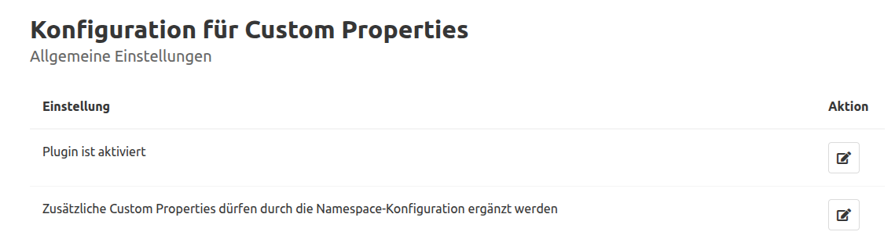
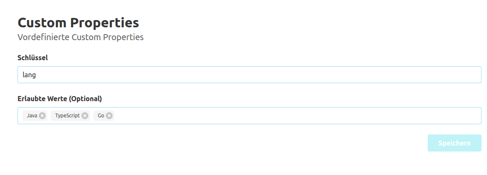
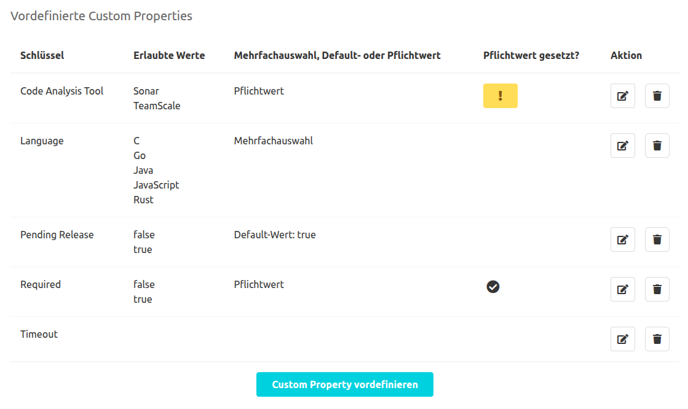
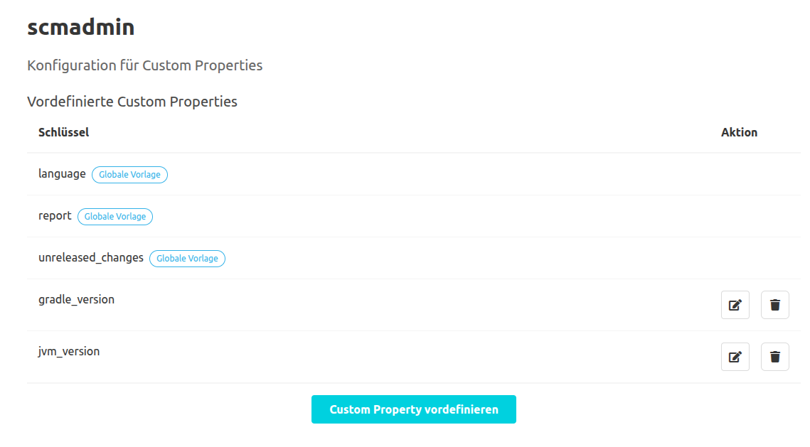

## Globale Konfiguration

### Allgemeine Einstellungen

Im Bereich "Allgemeine Einstellungen" unter "Administration" - "Einstellungen" - "Custom Properties"
kann das Plugin generell aktiviert bzw. deaktiviert werden.
Zudem ist es möglich, Konfigurationen auf Namespace-Ebene zu verhindern.
Dazu muss der Button zum Bearbeiten der jeweiligen Einstellung betätigt werden.
Dies navigiert den Benutzer zu einer Unterseite, auf der die Einstellung vorgenommen werden kann.

### Vordefinierte Schlüssel

Um den Benutzer beim Anlegen von Custom Properties zu unterstützen, können vordefinierte Schlüssel angelegt werden.
Um einen neuen Schlüssel anzulegen, muss der Button "Custom Property vordefinieren" betätigt werden.
Dadurch wird der Benutzer zu einer neuen Unterseite navigiert.
Hier kann der Benutzer in einem Text-Input einen neuen Schlüssel definieren.
Für vordefinierte Schlüssel gelten die gleichen Validierungsregeln, wie beim Anlegen einer Custom Property ([siehe Dokumentation zur Übersicht](../overview)).

Zusätzlich kann der Benutzer mit einem Chip-Input eine Liste von Werten definieren, welche
für Custom Properties mit dem jeweiligen Schlüssel verwendet werden dürfen.
Um einen Wert hinzuzufügen, muss dieser im Eingabefeld eingegeben und anschließend mit der Eingabetaste
bestätigt werden. Bestehende Werte können mit den kleinen "x"-Symbol neben dem Wert wieder aus der Liste entfernt werden.
Bereits für Repositories gesetzte Properties werden bei einer Änderung der Konfiguration nicht nachträglich validiert.

Des Weiteren kann der Benutzer einen Default-Wert für Custom Properties mit dem jeweiligen Schlüssel vorgeben.
Falls ein Default-Wert definiert ist und für ein Repository kein Custom Property mit dem jeweiligen Schlüssel gesetzt ist, 
gilt für dieses Repository implizit ein Custom Property mit dem Schlüssel und Default-Wert.
Sollten die Werte für das Custom Property uneingeschränkt sein (wenn also keine erlaubten Werte gesetzt sind),
erfolgt die Eingabe des Default-Werts mithilfe eines Text-Inputs.
Sind erlaubte Werte vorgegeben, dann steht ein Dropdown mit allen erlaubten Werten und einer leeren Eingabe als Optionen zur Verfügung.

Die vordefinierten Schlüssel können auch in der Schlüsselübersicht mithilfe der jeweiligen Aktions-Buttons bearbeitet und gelöscht werden.

## Namespace-Konfiguration

Auf Namespace-Ebene können weitere Schlüssel definiert werden.
Diese werden entsprechend nur für Repositories des jeweiligen Namespaces vorgeschlagen.
Das Erstellen, Bearbeiten und Löschen der Schlüssel erfolgt dabei analog zu der globalen Konfiguration.
Zusätzlich werden global definierte Schlüssel ebenfalls in der Schlüsselübersicht aufgelistet und mit dem Tag "Globale Vorlage" gekennzeichnet.
Diese können in der Namespace-Ebene nicht bearbeitet werden.

