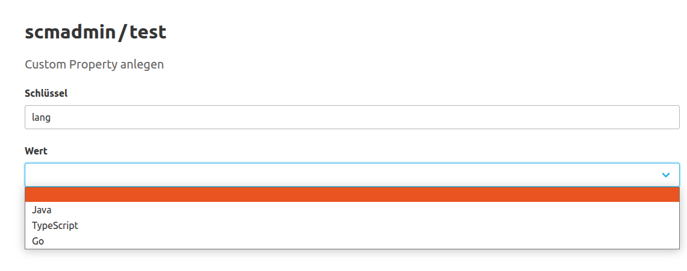
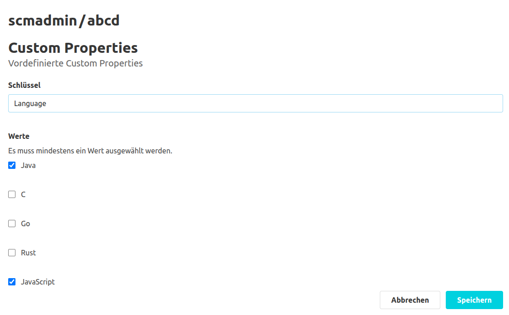
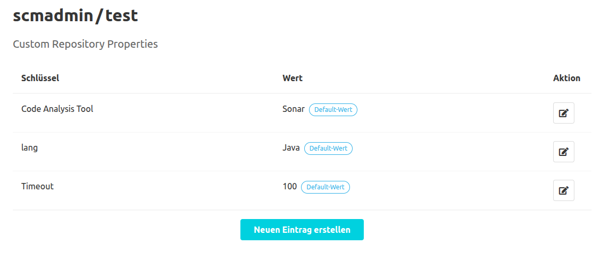
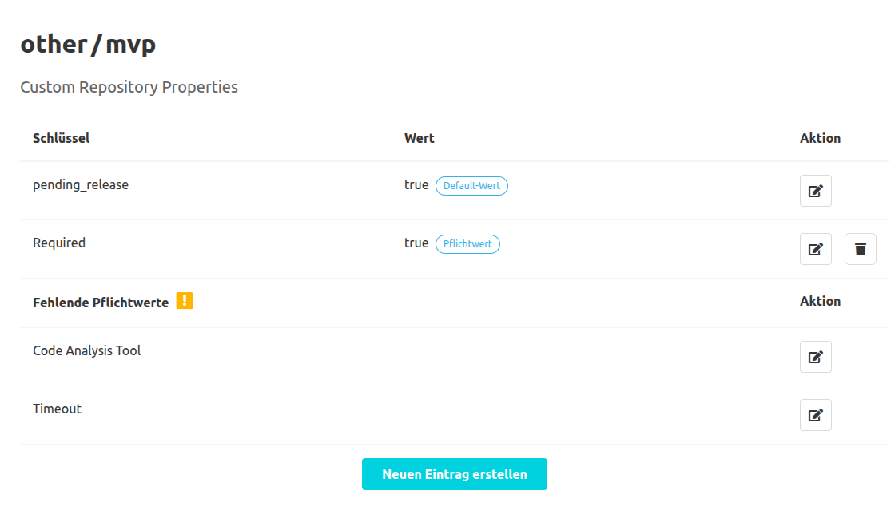
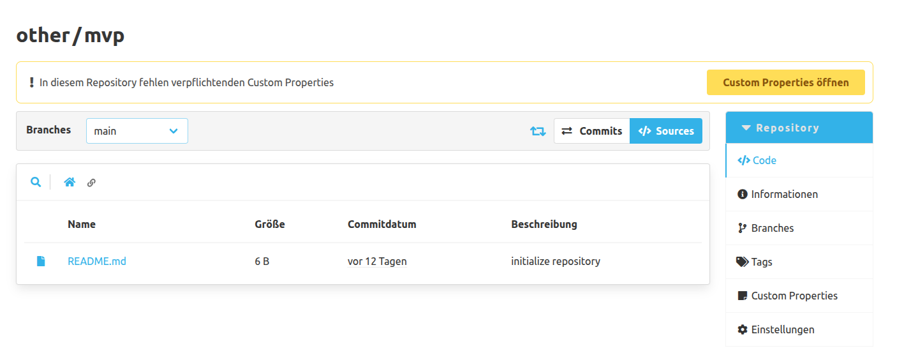

Mit diesem Plugin ist es möglich, für jedes Repository eine Sammlung von Custom Properties anzulegen.
Diese Properties werden als Schlüssel-Wert-Paare definiert.
Um eine Übersicht in Tabellenform von den bereits existierenden Properties zu sehen,
kann der Reiter "Custom Properties" in der Repository-Navigation angeklickt werden.

In dieser Übersicht ist es möglich, die bereits angelegten Properties zu betrachten, zu bearbeiten, zu löschen oder neue Properties anzulegen.
Mit dem Button "Neuen Eintrag erstellen", welcher sich unterhalb der Tabelle befindet, 
kann sich der Benutzer auf eine weitere Ansicht navigieren lassen, um neue Properties anzulegen.

## Erstellung von Custom Properties

In dieser Ansicht kann mithilfe von zwei Text-Inputs der Schlüssel und der dazugehörige Wert definiert werden.
Durch das Betätigen des "Speichern"-Buttons wird die Property angelegt.

Beim Eintragen eines Schlüssels ist es möglich, auch aus vordefinierten Schlüsseln auszuwählen.
Dazu müssen diese Schlüssel in der globalen oder der jeweiligen Namespace-Konfiguration definiert werden ([siehe Dokumentation zur Konfiguration des Plugins](../config)).
Um sich die vorhandenen Vorschläge anzuzeigen, muss der Text-Input zum Schlüssel fokussiert werden.
Anschließend kann die Pfeiltaste nach Unten gedrückt werden, um sich alle Vorschläge in einer Combobox anzeigen zu lassen.
Mit weiteren Benutzereingaben im Text-Input kann die Liste der vorgeschlagenen Schlüssel gefiltert werden.
Der Filter prüft dabei, ob die bisherigen Benutzereingaben in den Schlüsseln als Teil enthalten ist.
Der Filter ignoriert dabei die Groß- und Kleinschreibung.

Beim Anlegen der Property ist Folgendes zu beachten: 
1. Der Schlüssel darf nicht länger als 255 Zeichen sein.
2. Es dürfen nur Buchstaben, Ziffern, Punkte, Leerzeichen, Unterstriche, Slashes, Doppelpunkte, Bindestriche und @-Symbole verwendet werden.
3. Jeder Schlüssel darf pro Repository nur einmal vergeben werden.

Sollte man mehrere Werte für denselben Schlüssel anlegen müssen, 
dann kann in der Konfiguration eine Custom Property mit Mehrfachauswahl definiert werden. 
Für den Wert selbst gibt es keine weiteren Begrenzungen oder Validierungsregeln, 
es sei denn, der verwendete Schlüssel ist ein vordefinierter Schlüssel zu dem bestimmte Werte vorgegeben worden ([siehe Dokumentation zur Konfiguration des Plugins](../config)).
Falls dies der Fall ist und keine Mehrfachauswahl konfiguriert ist, kann der Benutzer mithilfe eines Dropdowns einen der erlaubten Werte auswählen.

Sollte die Mehrfachauswahl konfiguriert sein, dann kann der Benutzer mit einer Liste von Checkboxen aus den jeweiligen Werten wählen.

## Bearbeiten und Löschen von Custom Properties

Für das Bearbeiten und Löschen von Properties gibt es in jeder Zeile einen eigenen Button, um den jeweiligen Vorgang zu starten.
Das Bearbeiten einer Property erfolgt analog zum Erstellen eines Eintrags.

Für das Bearbeiten, Löschen und Erstellen von Properties ist es nötig, die Berechtigung für das Modifizieren der Repository-Metadaten zu haben.
Sollte dem Benutzer diese Berechtigung fehlen, werden die entsprechenden Buttons nicht angezeigt.

## Default Custom Properties

Falls in der Konfiguration auf globaler oder Namespace-Ebene Custom Properties mit einem Default-Wert definiert wurden,
dann erscheinen diese als Default Custom Properties in den jeweiligen Repositories, solange sie nicht explizit erstellt wurden.
Default Custom Properties unterscheiden sich dadurch, dass der Wert mit einem "Default-Wert" Tag versehen sind und man diese nicht löschen kann.

## Custom Properties mit einem Pflichtwert

Falls in der Konfiguration auf globaler oder Namespace-Ebene Custom Properties mit einem Pflichtwert definiert wurden,
dann werden diese in den Repositories auf zwei verschiedene Arten gekennzeichnet.
Falls die jeweilige Custom Property für das Repository definiert wurde, dann wird der Wert mit einem "Pflichtwert" Tag versehen.
Sollte die jeweilige Custom Property nicht definiert sein, dann erscheint der Schlüssel am unteren Ende der Tabelle mit den anderen fehlenden Pflichtwerten.

## Hinweis auf fehlende Custom Properties mit Pflichtwerten

Falls Custom Properties mit einem Pflichtwert definiert wurden, aber in einem Repository nicht definiert sind,
dann wird in dem jeweiligen Repository unterhalb des Titels ein Banner angezeigt.
Dieser informiert den Benutzer darüber, dass noch Custom Properties mit einem Pflichtwert angelegt werden müssen.
Dieser Banner enthält auch einen Link zu der Übersichtsseite mit den Custom Properties vom jeweiligen Repository.
