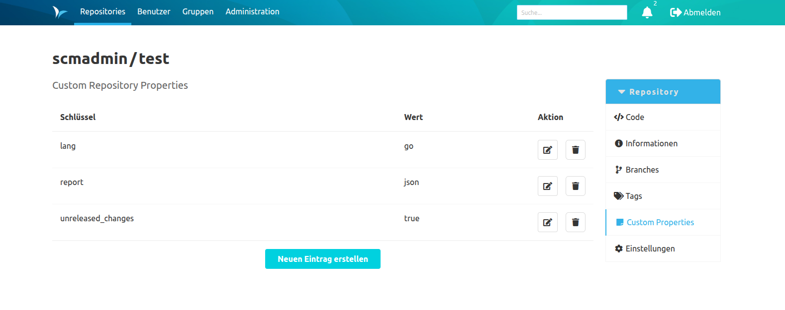
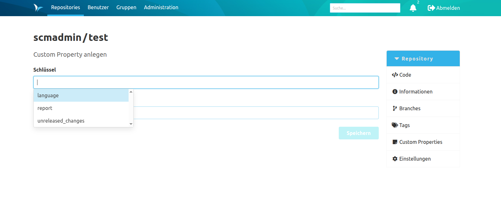

Mit diesem Plugin ist es möglich, für jedes Repository eine Sammlung von Custom Properties anzulegen.
Diese Properties werden als Schlüssel-Wert-Paare definiert.
Um eine Übersicht in Tabellenform von den bereits existierenden Properties zu sehen,
kann der Reiter "Custom Properties" in der Repository-Navigation angeklickt werden.

In dieser Übersicht ist es möglich, die bereits angelegten Properties zu betrachten, zu bearbeiten, zu löschen oder neue Properties anzulegen.
Mit dem Button "Neuen Eintrag erstellen", welcher sich unterhalb der Tabelle befindet, 
kann sich der Benutzer auf eine weitere Ansicht navigieren lassen, um neue Properties anzulegen.

In dieser Ansicht kann mithilfe von zwei Text-Inputs der Schlüssel und der dazugehörige Wert definiert werden.
Durch das Betätigen des "Speichern"-Buttons wird die Property angelegt.

Beim Eintragen eines Schlüssels ist es möglich, auch aus vordefinierten Schlüsseln auszuwählen.
Dazu müssen diese Schlüssel in der globalen oder der jeweiligen Namespace-Konfiguration definiert werden ([siehe Dokumentation zur Konfiguration des Plugins](../config)).
Um sich die vorhandenen Vorschläge anzuzeigen, muss der Text-Input zum Schlüssel fokussiert werden.
Anschließend kann die Pfeiltaste nach Unten gedrückt werden, um sich alle Vorschläge in einer Combobox anzeigen zu lassen.
Mit weiteren Benutzereingaben im Text-Input kann die Liste der vorgeschlagenen Schlüssel gefiltert werden.
Der Filter prüft dabei, ob die bisherigen Benutzereingaben in den Schlüsseln als Teil enthalten ist.
Der Filter ignoriert dabei die Groß- und Kleinschreibung.

Beim Anlegen der Property ist folgendes zu beachten: 
1. Der Schlüssel darf nicht länger als 255 Zeichen sein.
2. Es dürfen nur Buchstaben, Ziffern, Punkte, Leerzeichen, Unterstriche, Slashes, Doppelpunkte, Bindestriche und @-Symbole verwendet werden.
3. Jeder Schlüssel darf pro Repository nur einmal vergeben werden.

Mehrere Werte für denselben Schlüssel müssen als eine Property angelegt werden. 
Die einzelnen Werte werden mit einem Komma getrennt.
Für den Wert selbst gibt es keine weiteren Begrenzungen oder Validierungsregeln.

Für das Bearbeiten und Löschen von Properties gibt es in jeder Zeile einen eigenen Button, um den jeweiligen Vorgang zu starten.
Das Bearbeiten einer Property erfolgt analog zum Erstellen eines Eintrags.

Für das Bearbeiten, Löschen und Erstellen von Properties ist es nötig, die Berechtigung für das Modifizieren der Repository-Metadaten zu haben.
Sollte dem Benutzer diese Berechtigung fehlen, werden die entsprechenden Buttons nicht angezeigt.
