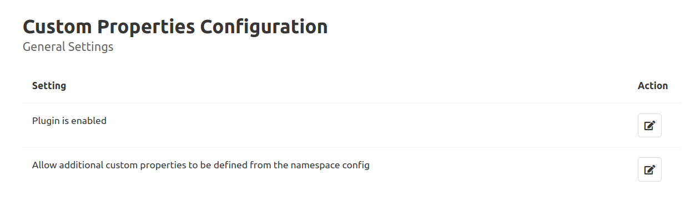
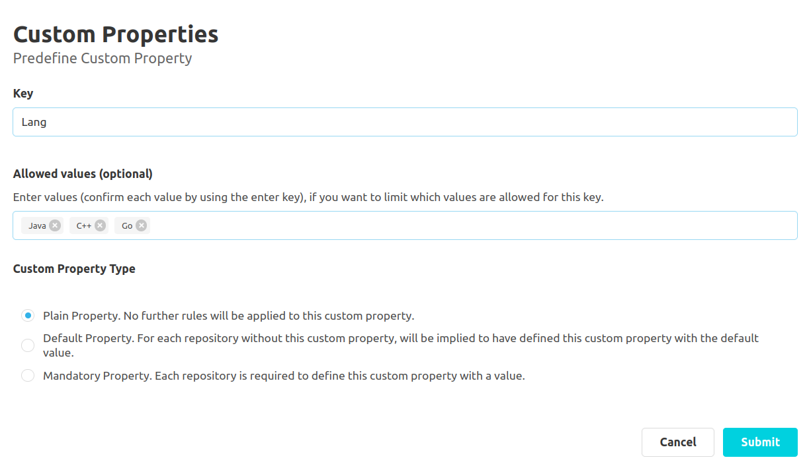
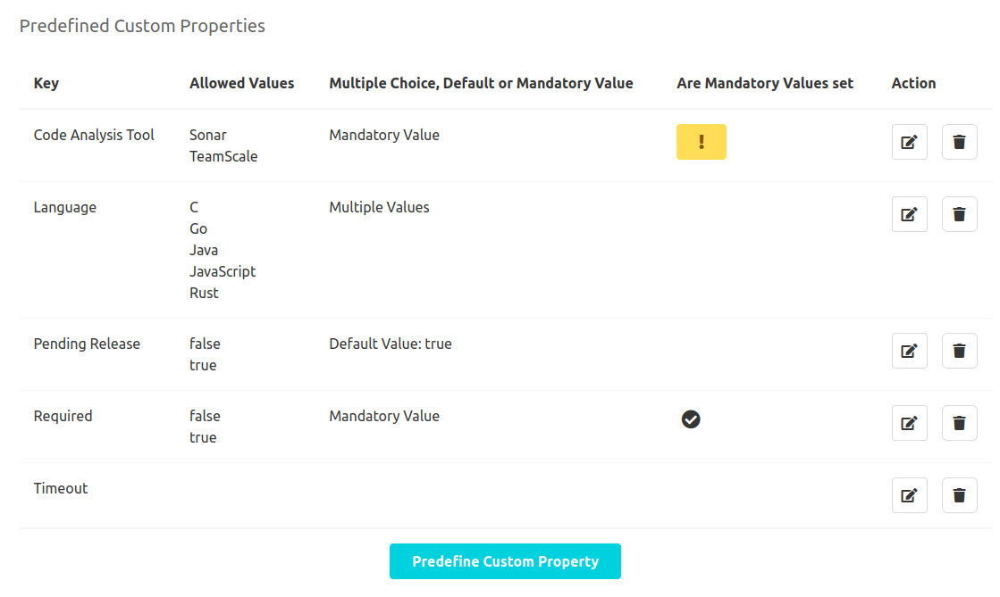
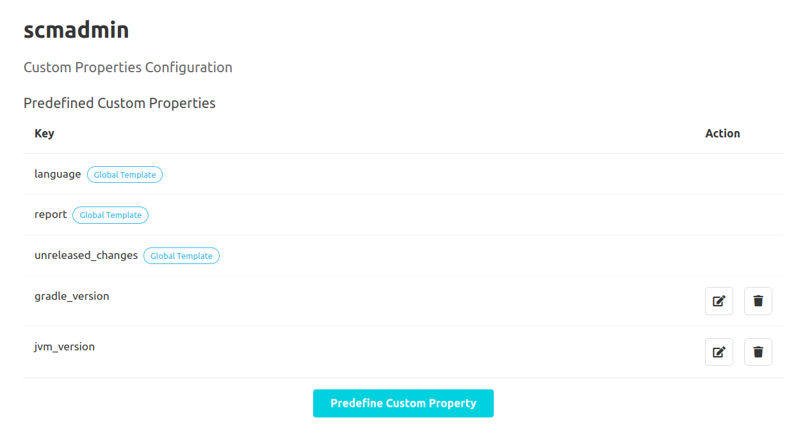

## Global Configuration

### General Settings

In the general settings area ("Administration" - "Settings" - "Custom Properties"), it is possible to activate/deactivate the plugin in general.
Furthermore it is also possible to control whether configurations are permitted at namespace level.
To do this, click on the button to edit the respective setting.
This navigates the user to a subpage where the setting can be configured.

### Predefined Keys

To assist the user in creating custom properties, it is possible to create predefined keys.
To create a new key, the 'Predefine Custom Property' button must be clicked.
This navigates the user to a new subpage.
Here, the user can define a new key in a text input field.
The same validation rules apply to predefined keys as when creating a custom property ([see documentation for overview](../overview)).

Additionally, the user can use a chip input to define a set of values, which are allowed to
be used for the custom properties with the corresponding key.
New values have to be entered in the input field and then be confirmed by pressing the enter key.
Existing values can be removed by pressing the small "x" symbol for the value.
Properties already set for repositories will not be validated subsequently, when the configuration is changed.

Furthermore, the user can specify a default value for custom properties with the respective key.
If a default value has been specified and no custom property with the respective key has yet been created for a repository,
the existence of a custom property with the respective key and the default value is assumed without explicitly creating it.
If no allowed values for the custom property have been set, the default value is entered using a text input.
If allowed values have been set, the user has a drop-down menu with all these values and an empty input as available options to choose from.

The predefined keys can also be edited and deleted using the respective action buttons in the key overview.

## Namespace Configuration

Additional keys can be defined at the namespace level.
These are only suggested for repositories of the respective namespace.
The creation, editing and deletion of keys is analogous to the global configuration.
In addition, globally defined keys are also listed in the key overview and marked with the tag 'Global Template'.
These cannot be edited at the namespace level.

