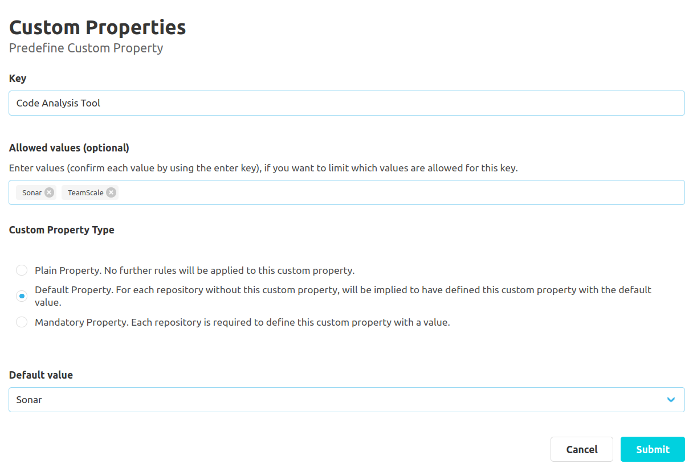
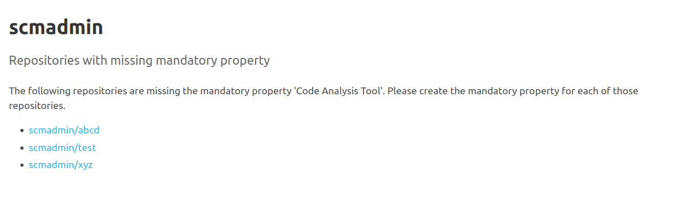

## Global Configuration

### General Settings

In the general settings area ("Administration" - "Settings" - "Custom Properties"), it is possible to activate/deactivate the plugin in general.
Furthermore, it is also possible to control whether configurations are permitted at namespace level.
To do this, click on the button to edit the respective setting.
This navigates the user to a subpage where the setting can be configured.

### Predefined Keys

#### Creation of a Predefined Key

To assist the user in creating custom properties, it is possible to create predefined keys.
To create a new key, the 'Predefine Custom Property' button must be clicked.
This navigates the user to a new subpage.
Here, the user can define a new key in a text input field.
The same validation rules apply to predefined keys as when creating a custom property ([see documentation for overview](../overview)).

Additionally, the user can use a chip input to define a set of values, which are allowed to
be used for the custom properties with the corresponding key.
New values have to be entered in the input field and then be confirmed by pressing the enter key.
Existing values can be removed by pressing the small "x" symbol for the value.
Properties already set for repositories will not be validated subsequently, when the configuration is changed.

Furthermore, the user can use a radio input to specify a type for the custom property.
There are four options for this:
A plain property, a default property, a mandatory property and a multiple choice property.

For mandatory properties, it is required that each repository has a custom property with the respective key and a value.

For default properties, a default value is implicitly assumed if the respective custom property has not yet been defined for a repository.
If default property is specified as the type, the user must also specify a default value.
If the values for the custom property are unrestricted (i.e. if no permitted values are set),
the default value is entered using a text input.
If permitted values are specified, a drop-down menu with all permitted values and an empty input field is available as options.

With multiple choice properties, it is possible to select more than one value for that custom property.
But for this type, it is required to define allowed values.

For plain properties no further rules will be applied.

#### Predefined Keys Overview

The predefined keys can also be edited and deleted using the respective action buttons in the key overview.
The key overview also shows whether a multiple choice, default or mandatory value has been defined for the respective custom property.
If the custom property has a mandatory value, icons are used to indicate whether all repositories have defined this mandatory property.
If at least one repository is missing, the user receives a warning icon as feedback.
This icon can be clicked to obtain an overview of all repositories for which the mandatory value still needs to be defined.

## Namespace Configuration

Additional keys can be defined at the namespace level.
These are only suggested for repositories of the respective namespace.
The creation, editing and deletion of keys is analogous to the global configuration.
In addition, globally defined keys are also listed in the key overview and marked with the tag 'Global Template'.
These cannot be edited at the namespace level.

