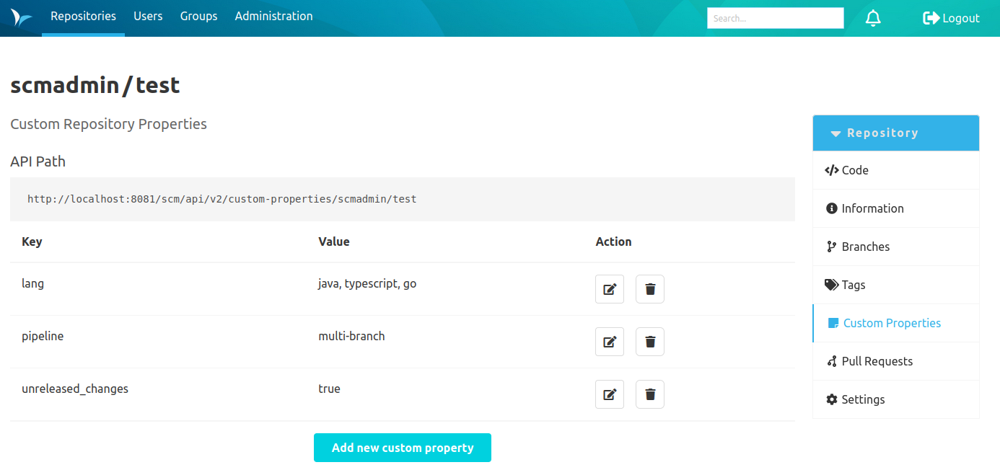
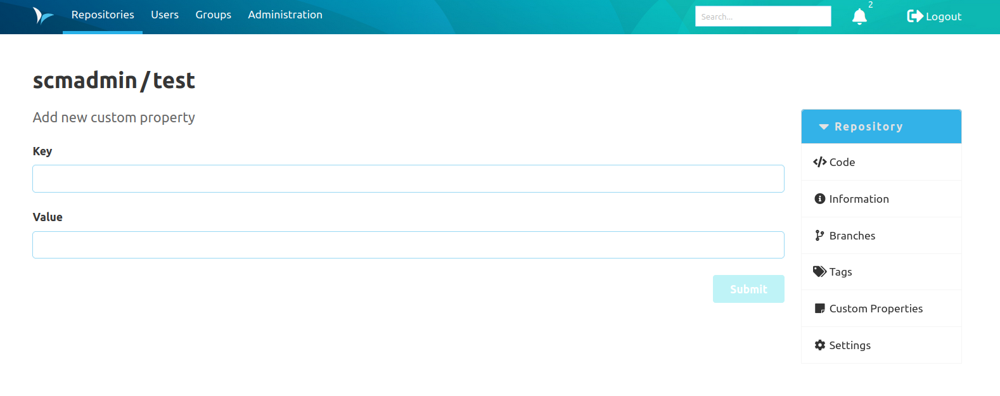
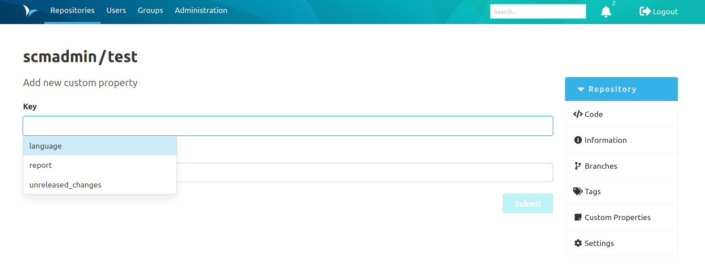
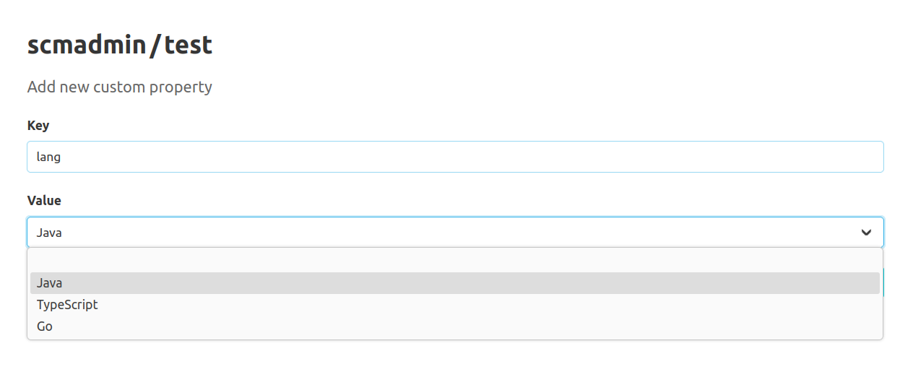

With this plugin it is possible to create a collection of user-defined properties for each repository.
These properties are defined as key-value pairs.
To see an overview of the existing properties in tabular form,
you can click on the 'Custom Properties' entry in the repository navigation.

In this overview it is possible to view, edit, and delete already created properties or create a new property.
With the 'Add new custom property' button, which is located below the table,
the user can navigate to another view to create a new property.

In this view, the key and the corresponding value can be defined using two text inputs.
The property is created by clicking the 'Submit' button.

When entering a key, it is also possible to select from predefined keys.
To do this, these keys must be defined in the global or respective namespace configuration ([see documentation on configuring the plugin](../config)).
To display the available suggestions, focus on the text input for the key.
Then press the down arrow key to display all suggestions in a combo box.
The list of suggested keys can be filtered by entering characters in the text input field.
The filter checks whether the current user input is present in the keys as a substring.
The filter is case-insensitive.

When creating the property, make sure that the key 
1. is not longer than 255 characters,
2. consists only of letters, numbers, periods, spaces, underscores, slashes, colons, dashes, and the @ character,
3. is unique within a repository(each key can be assigned only once).

Multiple values for the same key must be entered as a single property separated by commas. 
There are no restrictions on the value, unless a predefined key is being used with predefined values.
If this is the case, then the user can select one of the allowed values within a dropdown element.

For each custom property in the overview, there is a separate button for editing and deleting properties.
A property is edited in a similar way as it is created.

To edit, delete, and create properties, it is necessary to have the permission to modify the repository metadata.
If the user does not have this permission, the corresponding buttons will not be displayed.
